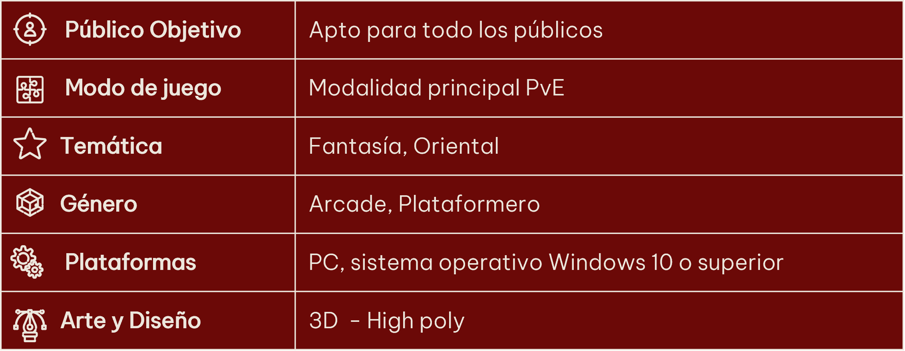
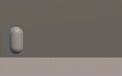
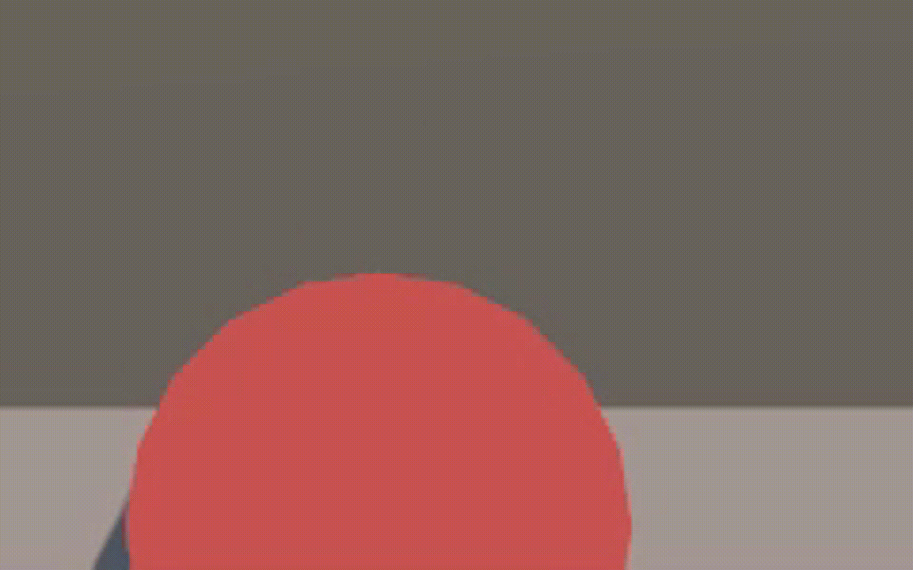
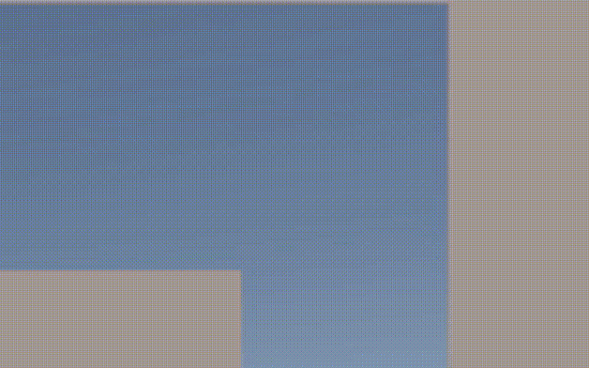
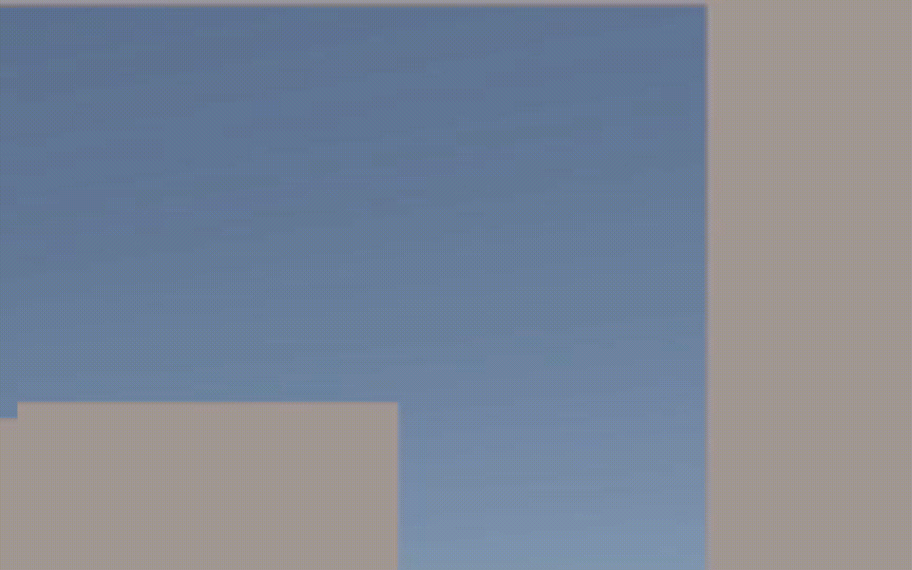
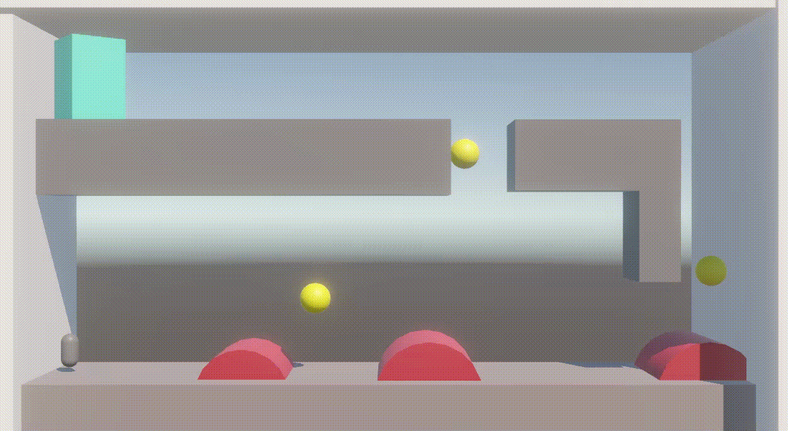
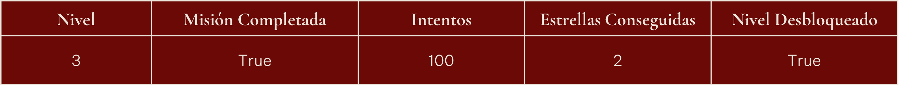

# 🐱 Whisker Warriors

## 🎬 Presentación del proyecto

**Whisker Warriors** es un juego de plataformas en 3D desarrollado como mi proyecto final de la tecnicatura en programación de videojuegos. Tuve un plazo de dos meses para realizar todo el juego, por lo que me enfoqué en que estuviera lo más terminado y pulido posible dentro de este corto tiempo. Para ello, prioricé una jugabilidad fluida, mecánicas bien implementadas y una estructura escalable que permitiera futuras expansiones sin grandes modificaciones.


## 🎮 Características



## 🎯 Enfoque del proyecto

Para el desarrollo de *Whisker Warriors*, se establecieron tres objetivos clave que guiaron el proceso de creación. La idea principal era diseñar un juego que cumpliera con estos requisitos fundamentales:

- ### ⏳ Desarrollo corto
    El objetivo era crear un juego en un tiempo reducido, centrándose en mecánicas esenciales y evitando sobrecargar el desarrollo con sistemas complejos.

- ### ⚡ Jugabilidad dinámica
    Se priorizó una jugabilidad fluida y responsiva, donde el jugador pueda moverse con precisión y rapidez, asegurando una experiencia entretenida y accesible.

- ### 🔄 Ampliable
    El concepto del juego fue diseñado para ser fácilmente ampliable, permitiendo que con una base sólida de gameplay se puedan desarrollar nuevos niveles y expandir el juego sin necesidad de rehacer grandes partes del código o las mecánicas centrales.

## Proceso de Creacion del Juego

<details>

## 🎨 Creación del personaje

El protagonista es un gato ninja ágil. Su diseño se basó en referencias de la cultura oriental y felina, buscando transmitir flexibilidad y destreza en su movilidad. Se realizaron varios prototipos iniciales para definir su aspecto y animaciones.

### 📷 Bocetos y prototipos iniciales

.png)  .png) .png)

## 🏗️ Proceso de creación del proyecto

El desarrollo del juego se realizó en varias capas para estructurar mejor cada componente:

### ⚙️ Mecánicas base
- Movimiento del personaje: desplazamiento, salto y precisión en plataformas.
- Interacción con elementos del entorno.







### 🏰 Niveles
- Diseño modular de escenarios.
- Implementación de obstáculos y metas.



### 📜 Menús y UI
- Creación de menús de inicio, pausa y opciones.
- Diseño de HUD minimalista para la experiencia del jugador.

Menu Principal


Selector de niveles


### 💾 Sistema de guardado
Para el sistema de guardado, inicialmente se consideró utilizar una pequeña base de datos en SQLite, pero fue descartada rápidamente porque no se necesitaba almacenar una gran cantidad de datos. Luego, se evaluó el uso de un archivo en formato CSV, pero también se descartó debido a su baja legibilidad. Finalmente, para facilitar las pruebas, se optó por un archivo en formato XML.

El archivo XML sigue esta estructura:



### 🎨 Arte y diseño
- Creación de modelos 3D en Blender y Zbrush.
- Creacion de arte 2D en Adobe Illustrator.
- Texturización y sombreado acorde a la ambientación.

### 🐾 Integración del personaje
- Implementación de animaciones y físicas.
- Adaptación del personaje a las mecánicas del entorno.


</details>

## 🚀 Instalación

Puedes jugar *Whisker Warriors* de tres maneras:

1. **Ejecutarlo en un servidor local**: Clona el repositorio y ábrelo en un sevidor local como Live Server de VScode.
   ```bash
   git clone https://github.com/FacuSB/Proyecto_Integrador_Final.git
   ```
2. **Jugarlo en la web**: Accede a la versión en línea a través de este enlace: [Jugar en la web](https://facusb.itch.io/whisker-warriors).
3. **Descargar la versión para PC**: Si prefieres jugar de forma offline, puedes descargar el juego desde el siguiente enlace. El link de descarga se encuentra debajo de la descripción: [Descargar para PC](https://facusb.itch.io/whisker-warriors).

## 🛠️ Tecnologías usadas

- **Motor**: Unity  
- **Lenguaje**: C#  
- **Modelado 3D**: Blender, Zbrush, Substance Painter  
- **Diseño 2D**: Adobe Illustrator, Adobe After Effects

